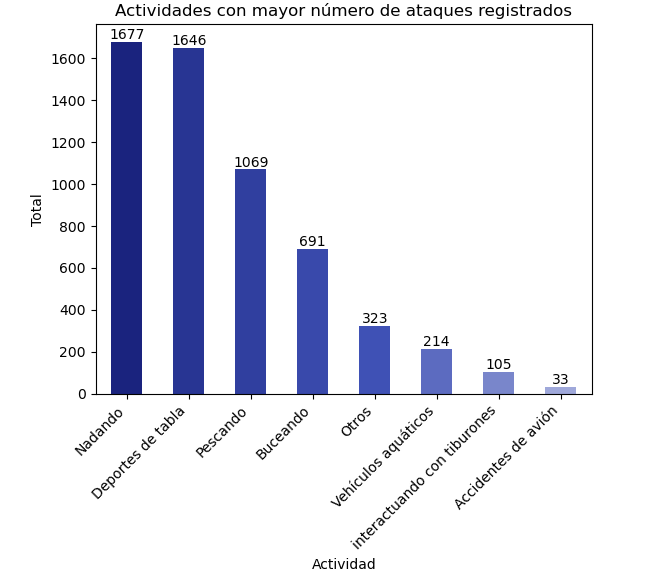
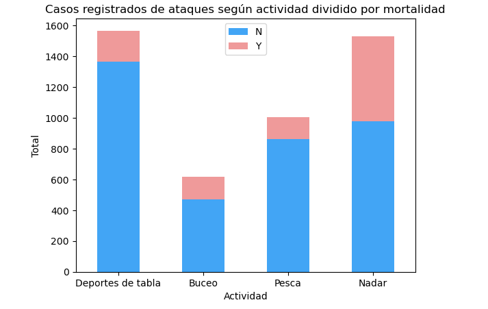
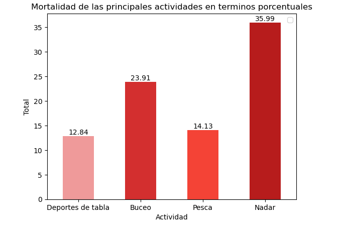

# Los tiburones son nuestros amigos 
El otro día estaba barajando las posibilidades las posibilidades de ir de viaje a Australia, me gusta mucho practicar deportes de tabla (tanto en tierra como en el mar) así que decidí consultarlo con la familia. \
Mala mi suerte que, justo el día anterior, entraba en programación un documental sobre tiburones en La Dos. Así que tengo que convencerles de alguna manera que puedo hacer el viaje y volver sano y salvo de una pieza. 

Para ello, quiero demostrarles 3 hipótesis diferentes para que disminuir su preocupación: 

1: No soy el "público target" de los ataques de tiburón \
2: Los deportes de tabla son seguros \
3: Si me pasa algo, seguramente será en el lado izquierdo, que no lo uso tanto como el derecho. 

# No soy el público target
Para entender cómo se analizará esta parte, primero debo compartir el origen de los datos. El dataset analizado es una recopilación de ataques de tiburón, por lo que el hecho que voy a intentar entender es, en caso de que haya un ataque de tiburón, cúan probable es que lo sufra "alguien como yo". 

Así que lo primero de todo será definir qué soy yo:
- Soy un ser humano de sexo biológico masculino.
- Tengo entre 25-30 años.
- Me gusta practicar deportes de tabla.
- Mi localización será en Australia.

Análizamos entonces cómo está distribuida la muestra en cuanto a sexo biológico: \
 \
La muestra está dividida en un 90% sexo masculino y un 10% sexo femenino. 

Observamos la distribución de la variable edad en la muestra: \
 \
Vemos que las personas atacadas por tiburones, por norma general son gente joven, de hecho, podemos considerar que, en caso de haber un ataque de tiburón, será extraño que esta persona tenga más de 60 años. \
Algo que observamos que sí es más normal es que, si se produce el ataque de un tiburón, sea a una persona entre 25 y 30 años, ya que la media (línea roja) está justo entre esa franja de edad. 

Turno de las actividad: \
 \
Dentro del aspectro total de actividades que se pueden llevar a cabo en el mar, se han seleccionado aquellas que más aparecían en el dataset, entre estas, la gran mayoría de ataques registrados se concentra en personas que estaban nadando y personas que estaban practicando deportes de tabla. 

Para finalizar, miraremos los países más nombrados: \
 \
Ya que es una variable categórica y son muchos los países que tenemos, representaremos la distribución en una nube de palabras. Las tres palabras con más tamaño y, por ende, las más repetidas en el dataset son: 
- Usa
- Australia
- South Africa

Además, aprovechamos para mirar también la evolución de los ataques registrados a lo largo de los años partiendo desde el 1900: \
 \
Parece que el registro de los ataques de tiburón va en aumento a lo largo de los años, aunque no tenemos manera de diferenciar si es que la especie está más agresiva o es que hay mayor facilidad de documentación y recopilación de los casos. 

Con los datos presentados, **No puedo confirmar la primera hipótesis**. Como no podemos saber la probabilidad de sufrir un ataque puesto que nuestro dataset no tiene información de personas que no han sufrido ningún ataque, debo basarme en la muestra que tengo y, por lo que hemos visto, gran parte de la muestra se compone de gente como yo.

# Los deportes de tabla son seguros

Como con los resultados del primer análisis no va a ser posible convencer a mi familia. Investigaré sobre los deportes de tabla en particular. 

Primero de todo, presneto una matriz de correlación con las variables categóricas que se han usado en en anterior análisis convertidas a 1 si mi perfil las cumple y a 0 si no: \
 \
Se pueden observar tres correlaciones ligeramente superiores al resto dentro de la matriz: 

1. Sexo & Actividad: parece que, según datos de nuestro dataframe, es más probable que una persona de sexo masculino practique deportes de tabla.
2. Fatal & País: se observa una pequeña correlación positiva entre las variables fatal y país, por lo que entendemos que es más probable que un ataque resulte mortífero en Australia.
3. Fatal & Actividad: Hay una correlación negativa entre los deportes de tabla y los accidentes mortíferos. Según parece no suele coincidir que un accidente a una persona que practica deportes de tabla sea fatal. 

análizamos de manera más profunda esta última correlación: \
 \
Representamos las diferentes categorías de actividades que habíamos consultado antes, con un filtro sobre aquellas que no son consideradas deportivas en su esencia. Así como veíamos antes, los deportes de tabla y actividades relacionadas con nadar están muy parecidas en cuanto a casos pero la parte de casos mortales es mucho más elevada en personas que nadan. 

Podemos ver el mismo gráfico pero de manera porcentual: \
 \
En términos porcentuales, los deportes de tabla son los que presentan un menor porcentaje de mortalidad. Actividades como nadar o bucear son las que, en caso de ser atacado por un tiburón, la persona tiene menores probabilidades de sobrevivir. 

Además, podemos hacer un análisis similar comparando el caso particular de Australia con el resto del mundo: \
 \

Así como hemos visto antes, aquí entendemos mejor la correlación positiva entre Australia y mortalidad, ya que esta es mayor que la que presentan otros países en las actividades relacionadas con nadar y el buceo. \
La buena noticia de este gráfico es que confirmamos que los deportes de tabla no tienen un alto índice de mortalidad y que este es similar al del resto del mundo. Podemos concluir que es la segunda actividad aquática con menor probabilidad de muerte.

**Aun no podemos concluir que los deportes de tabla son seguros.** Hemos visto que hay muchos casos documentados y echaremos un vistazo a ver qué pasa con estas personas que son atacadas.

Para ello, consultaremos la variable "Injury" que nos ofrece detalles sobre la parte del cuerpo en la que se han sufrido los ataques. Además observamos que en la misma variable se tiene en cuenta aquellos ataques donde no ha habido ningún tipo de lesión: \
 \
Volvemos a representar en un gráfico de barras las partes del cuerpo que más sufren en los ataques de tiburón. Las piernas, en este caso, van por delante con bastante diferencia respecto a las demás. 

Comprobamos de igual manera la mortalidad porcentual de estas variables: \ 

 \
Aunque acumulen la mayoría de casos, un ataque a las piernas no suele ser mortal así como tampoco lo suele ser un ataque en los brazos. \
Las personas que han sufrido ataques en el torso no suelen correr la misma suerte.

Hago el mismo ejercicio pero teniendo solo en cuenta los casos de deportes de tabla: \ 

 \
Es interesante ver como, para los deportes de tabla, tienen una gran cantidad de ataques donde no se produce ninguna lesión, así como también tienen una gran cantidad de ataques donde hay lesiones en las piernas. 

Para el caso particular de Australia, parece que la tendencia es similar aunque los ataques a las piernas parecen disminur: \ 

 

**¿Cómo se podría explicar este suceso?**\
Podemos volver sobre nuestros pasos y echarle un vistazo a la columna "Injury" sin limpiar, ya que esta nos proporcionaba en mayor detalle qué sucedía en cada ataque, filtramos el dataset por aquellos casos a personas practicando deportes de tabla en Australia: \ 
 \
Lo primero que nos llama la atención es la aparición de la palabra "Fatal", en el dataset original es una variable común y bastante estandarizada, es por eso que destaca por encima de las demás. 

Si observamos con detenimiento vemos que muchas de los conjuntos de palabras que salen hacen referencia a lesiones del pie (lo habíamos visto en tablas anteriores) pero también podemos ver que tienen un gran peso palabras como "Board bitten", "Surfboard bitten", "board bumped", "Shark bit surfboard"... 

Por lo que parece la baja mortalidad y la alta relación con salir ileso de los ataques puede tener algo que ver con que las tablas actúen como escudo ante los ataques de los tiburones. 

No me precipitaría a la conclusión pero, por lo que hemos visto en los datos, **parece que los deportes de tabla sí son deportes seguros (o almenos más que otras actividades aquáticas)**

# A los tiburones les gusta el lado derecho
Para concluir el análisis, ya que hemos visto que las extremidades más sensibles a sufrir ataques son las piernas, vamos a comprobar si los tiburones tienen cierta inclinación por atacar a un lado en concreto: \
 \
Vemos que, en general hay una pequeña inclinación hacia los ataques por la parte izquierda.

Pero como hemos visto que los ataques a las piernas tienen mucho peso dentro del dataset, miraremos por separado para ver como se comportan los ataques a las diferentes extremidades: \
 \

Observamos que para las extremidades más afectadas por ataques a los tiburones. El lado izquierdo siempre suele recibir más ataques que el lado derecho (por una diminuta diferencia)

En cuanto a la última hipótesis, **no podemos concluir que los tiburones tengan un lado preferido al que atacar, aunque vemos que suelen registrarse unos pocos más de ataques por el lado izquierdo que por en derecho.**
